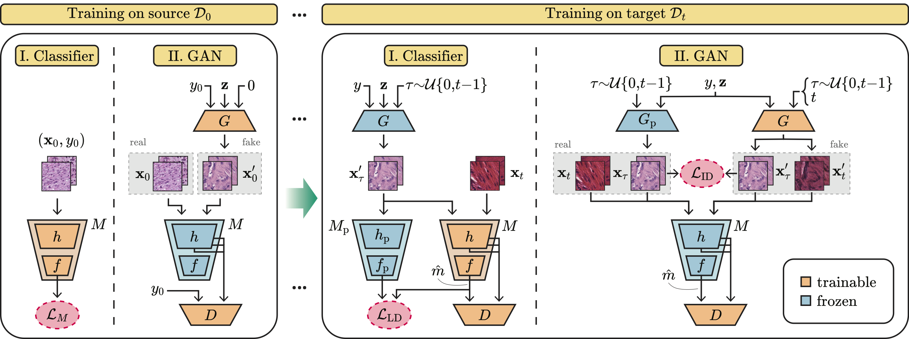

# Multi-scale Feature Alignment for Continual Learning of Unlabeled Domains

This repository contains the PyTorch code of our paper [Multi-scale Feature Alignment for Continual Learning of Unlabeled Domains](https://arxiv.org/abs/2302.01287).



## Abstract

Methods for unsupervised domain adaptation (UDA) help to improve the performance of deep neural networks on unseen domains without any labeled data. Especially in medical disciplines such as histopathology, this is crucial since large datasets with detailed annotations are scarce. While the majority of existing UDA methods focus on the adaptation from a labeled source to a single unlabeled target domain, many real-world applications with a long life cycle involve more than one target domain. Thus, the ability to sequentially adapt to multiple target domains becomes essential. In settings where the data from previously seen domains cannot be stored, e.g., due to data protection regulations, the above becomes a challenging continual learning problem. To this end, we propose to use generative feature-driven image replay in conjunction with a dual-purpose discriminator that not only enables the generation of images with realistic features for replay, but also promotes feature alignment during domain adaptation. We evaluate our approach extensively on a sequence of three histopathological datasets for tissue-type classification, achieving state-of-the-art results. We present detailed ablation experiments studying our proposed method components and demonstrate a possible use-case of our continual UDA method for an unsupervised patch-based segmentation task given high-resolution tissue images.

## Installation

```
git clone https://github.com/histocartography/multi-scale-feature-alignment
cd multi-scale-feature-alignment
conda env create -f environment.yml
conda activate mfa
```

Install pytorch and torchvision:

```
conda install pytorch torchvision pytorch-cuda=12.1 -c pytorch -c nvidia
```


## Data

We evaluated our method on a sequence of three histopathological datasets for tissue type classification:

- [Kather16](https://zenodo.org/record/53169)
- [Kather19](https://zenodo.org/record/1214456)
- [CRC-TP](https://warwick.ac.uk/fac/cross_fac/tia/data/crc-tp) (as of Dec 2023 this is not publicly available anymore)

Inspired by [Abbet et al. (2022)](https://www.sciencedirect.com/science/article/pii/S1361841522001207), we rearrange and align the heterogeneous classes from the different datasets into a common set of 7 medically-relevant patch classes: tumor epithelium, stroma, lymphocytes, debris, normal mucosal glands, adipose, and background. The mapping to numerical class IDs is shown below:

```
{
    "tumor": 0,
    "stroma": 1,
    "lympho": 2,
    "debris": 3,
    "normal": 4,
    "adipose": 5,
    "back": 6
}
```

The datasets should be stored under a common data path, e.g., `/path/to/data`. The corresponding labels (with mappings) and train/val/test splits are provided in [labels.csv](doc/labels.csv) and [splits.csv](doc/splits.csv), respectively.

```
/path/to/data
├── kather16/
    ├── 01_TUMOR
    ├── 02_STROMA
    ├── ...
├── kather19/
    ├── ADI
    ├── BACK
    ├── ...
└── crctp/
    ├── Training/
        ├── Benign
        ├── Complex
        ├── ...
    ├── Testing/
        ├── ...
```

## Training

The model is trained using the script [trainer_config.py](bin/trainer_config.py) and a configuration file similar to the examples provided [here](source/config/examples). The most important hyperparameters are the following:

- `lr`: learning rate of the classifier $f$
- `disc_lr`: learning rate of the discriminator $D$ during domain adaptation
- `gen_lr`: learning rate of the feature extractor $h$ during domain adaptation
- `gan_disc_lr`: learning rate of the discriminator $D$ during GAN training
- `gan_gen_lr`: learning rate of the generator $G$ during GAN training
- `lamb`: logit distillation weight (denoted as $\lambda_\mathrm{LD}$ in ther paper)
- `delt`: image distillation weight (denoted as $\lambda_\mathrm{ID}$ in ther paper)

### Source training

Train the model on the source domain (Kather19):

```
# classifier
python bin/trainer_config.py --json-file ./source/config/examples/source/source_clf.json

# generative model
python bin/trainer_config.py --json-file ./source/config/examples/source/source_gen.json
```

### Adapt to the first target domain

Adapt to Kather16:
```
# 1. classifier
python bin/trainer_config.py --json-file ./source/config/examples/step_1/k16_clf.json

# 2. generative model
python bin/trainer_config.py --json-file ./source/config/examples/step_1/k16_gen.json
```

or to CRC-TP:

```
# 1. classifier
python bin/trainer_config.py --json-file ./source/config/examples/step_1/crctp_clf.json

# 2. generative model
python bin/trainer_config.py --json-file ./source/config/examples/step_1/crctp_gen.json
```

### Adapt to the second target domain

Adapt to CRC-TP:

```
# classifier
python bin/trainer_config.py --json-file ./source/config/examples/step_2/k16_crctp_clf.json
```

or to Kather16:

```
# classifier
python bin/trainer_config.py --json-file ./source/config/examples/step_2/crctp_k16_clf.json
```

## Citation

If you use this code, please make sure to cite our work:

```
@article{thandiackal2024mfa,
    title = {Multi-scale Feature Alignment for Continual Learning of Unlabeled Domains},
    journal = {IEEE Transactions on Medical Imaging},
    year = {2024},
    author = {Kevin Thandiackal and Luigi Piccinelli and Rajarsi Gupta and Pushpak Pati and Orcun Goksel},
}
```
